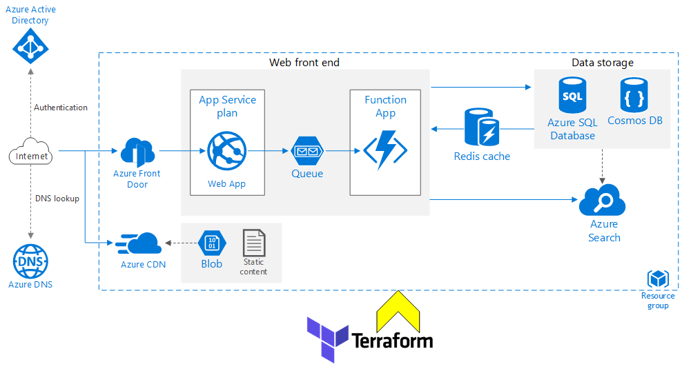

# Scalable-WebApp
This reference architecture shows how to run an Azure App Service application in multiple regions to achieve high availability.

## **Summary**
The architecture shows proven practices for a scalable web application that uses many Azure Services. For more details on the each resources please click on this [link](https://docs.microsoft.com/en-us/azure/architecture/reference-architectures/app-service-web-app/multi-region)

  
  <h3 align="center">Reference Architecture of Single region Scalable Web Application </h3>

